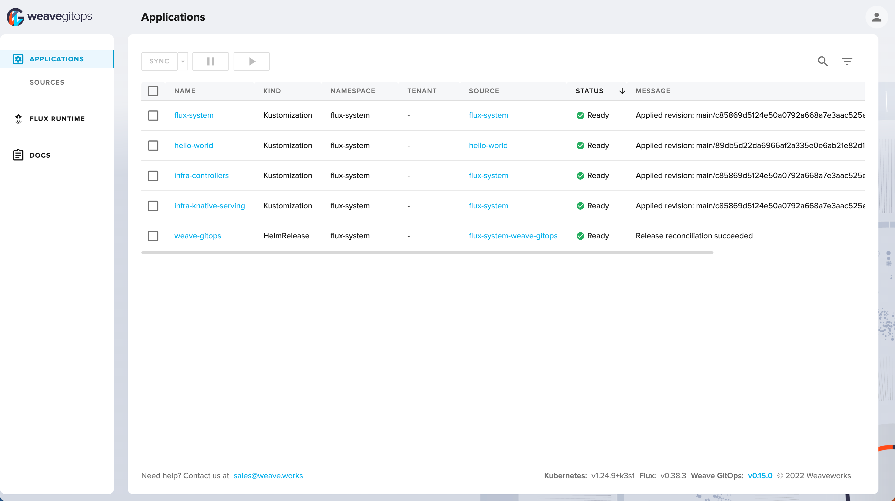

# Hello World!, the GitOps way

A demo to show case how to deploy the traditional Hello World application using [GitOps](https://www.gitops.tech/). The goal of this demo is to get started with GitOps on your laptops, understand its principles etc.,

For this demo we will be using [FluxCD](https://fluxcd.io/) as the GitOps platform on Kubernetes.

## Fork the demo repo

Run the following command to fork the demo repo under your account,

```shell
gh repo fork <https://github.com/kameshsampath/flux-hello-world>
cd flux-hello-world
```

For the rest of the tutorial this folder will be called as `$GITOPS_DEMO_HOME`.

## Whats Required

### Tools

#### Using Dev Containers

**Recommended** to use [VSCode DevContainers](https://code.visualstudio.com/docs/devcontainers/containers) to avoid installing tools locally. 

Click to [Install the Dev Containers Extension](vscode:extension/ms-vscode-remote.remote-containers). The Dev container has all the required tools installed and configured. 

#### All Local(Optional)

If you want to do all locally then install the following tools,

Download and add the following tools and add your `$PATH`,

- [Task](https://taskfile.dev/)
- [Flux](https://fluxcd.io/flux/cmd/)
- [K3D](https://k3d.io)
- [Docker Desktop](https://www.docker.com/products/docker-desktop/)
- [GitHub CLI](https://github.com/cli/cli)

### GitHub

- [GitHub PAT](https://docs.github.com/en/authentication/keeping-your-account-and-data-secure/creating-a-personal-access-token)
  
- A GitHub user to fork the GitOps Demo Fork

The following two variables is **required** for the demo to work, set and export them as shown,

```shell
export GITHUB_USER=<your github username>
export GITHUB_TOKEN=<your github PAT>
```

### Environment Variables

>**NOTE**: 
> Only needed for all local setup, when using Dev Containers all required environment variables from `.env.example` are automatically loaded
> You can safely **SKIP** this section when using Dev Containers

Copy `$GITOPS_DEMO_HOME/.env.example` --> `$GITOPS_DEMO_HOME/.env` and update the `.env` to update `$GITHUB_USER`, `$GITHUB_TOKEN`. Leave the `HELLO_WORLD_APP_FORK_REPO` as it is we will update it later.

Load the environment variables on to current shell. Open a terminal window and navigate to `$GITOPS_DEMO_HOME` and run,

```shell
source .env
```

Test if all the variables are loaded successfully,

```shell
# should return the directory where you have cloned this demo sources
echo $GITOPS_DEMO_HOME
```

## Create Cluster

Run the following command to create local kubernetes([k3s](https://k3s.io)) cluster,

```shell
task create_cluster
```

If all went well running the command `kubectl cluster-info` should show a similar output,

```text
Kubernetes control plane is running at https://0.0.0.0:62779
CoreDNS is running at https://0.0.0.0:62779/api/v1/namespaces/kube-system/services/kube-dns:dns/proxy
Metrics-server is running at https://0.0.0.0:62779/api/v1/namespaces/kube-system/services/https:metrics-server:https/proxy
```

## Bootstrap

The demo setup will have the following components,

- FluxCD   - the GitOps platform
- Knative  - the serverless platform to deploy our services
- Weave GitOps OSS - the GitOps UI Dashboard

Run the following command to bootstrap FluxCD and all other infrastructure components,

> ***TIP**: All the commands we run as part of this demo has task associated. E.g. The following bootstrap command can be run using `task bootstrap`

```shell
flux bootstrap github \
  --owner=$GITHUB_USER \
  --repository=flux-hello-world \
  --branch=main \
  --personal \
  --path=./clusters/dev
```

The command instructs flux to hook the repo `$GITHUB_USER/flux-hello-world` and start watching it for changes on branch `main`, path `./clusters/dev`.

>**NOTE**: It will take few mins for bootstrap to complete, depending upon your bandwidth.

### Knative

Wait for all Knative Serving components to be ready,

```shell
watch kubectl get pods -n knative-serving
```

Ensure the following _Statuses_ before moving on to next section,

```shell
NAME                                     READY   STATUS      RESTARTS   AGE
domainmapping-webhook-78d8f55ff-gbvvk    1/1     Running     0          100s
webhook-d44b476b8-lwtnx                  1/1     Running     0          100s
autoscaler-6c94f894f7-wwxbf              1/1     Running     0          100s
activator-56948b7c57-hmx76               1/1     Running     0          100s
controller-8c6b99cb7-v2mfw               1/1     Running     0          100s
net-kourier-controller-c748f7c64-q7cdg   1/1     Running     0          100s
domain-mapping-9fd944b76-8zdk9           1/1     Running     0          100s
default-domain-9l96p                     0/1     Completed   0          100s
```

#### Knative Ingress Check

```shell
kubectl describe configmap/config-network --namespace knative-serving
```

Should display an output like,

```text
...(trimmed for brevity)
ingress-class:
----
kourier.ingress.networking.knative.dev
...
```

#### Knative Domain Check

```shell
kubectl describe configmap/config-domain --namespace knative-serving | less
```

>**NOTE**: If you dont get the output as shown below, try running the above command after few seconds.

Should display an output like,

```text
...(trimmed for brevity)
Data
====
127.0.0.1.sslip.io:
----
...
```

#### Deploy test app

```shell
cat <<EOF | kubectl apply -f -
apiVersion: serving.knative.dev/v1 # Current version of Knative
kind: Service
metadata:
  name: helloworld-go # The name of the app
  namespace: default # The namespace the app will use
spec:
  template:
    spec:
      containers:
        - image: gcr.io/knative-samples/helloworld-go # The URL to the image of the app
          env:
            - name: TARGET # The environment variable printed out by the sample app
              value: "All set to deploy Hello World, the GitOps way!!!"
EOF
```

Wait for the service to be ready,

```shell
watch kubectl get ksvc
```

It will take few seconds for the service to be ready, a ready service should show an output like,

```text
NAME            URL                                               LATESTCREATED         LATESTREADY           READY   REASON
helloworld-go   http://helloworld-go.default.127.0.0.1.sslip.io   helloworld-go-00001   helloworld-go-00001   True
```

If all went well you can cURL the service,

>**IMPORTANT**: The service needs to be called from the **Host** as all ports from the services are forward to host docker socket

```shell
curl http://helloworld-go.default.127.0.0.1.sslip.io:30080
```

It will return a response like `Hello All set to deploy Hello World, the GitOps way!!!!`.

Clean up the test service using the command,

```shell
kubectl delete ksvc helloworld-go
```

### GitOps UI

For this demo we will be using [Weave GitOps OSS](https://github.com/weaveworks/weave-gitops) for UI and Dashboard.

Check if the Weave GitOps OSS dashboard is up,

```shell
kubectl rollout status -n flux-system deploy/weave-gitops --timeout=60s
```

Once its running its accessible via <http://127.0.0.1.sslip.io:30091>. The default user credentials is `admin/flux`.

## Deploy Hello World Application

Let's create the required GitOps resources for deploying <https://github.com/kameshsampath/go-hello-world>.

## Fork Application Repo

```shell
cd "$GITOPS_DEMO_HOME/work"
gh repo clone https://github.com/kameshsampath/go-hello-world
cd go-hello-world
export HELLO_WORLD_APP_FORK_REPO=$(gh repo view --json url -q '.url')
```

Let us call your <https://github.com/kameshsampath/go-hello-world> fork as `$HELLO_WORLD_APP_FORK_REPO`.

## Git Repository Source

Create the [GitRepository](https://fluxcd.io/flux/cmd/flux_create_source_git/) which will watched for manifest changes,

```shell
flux create source git hello-world \
  --url=$HELLO_WORLD_APP_FORK_REPO \
  --branch=main \
  --interval=30s \
  --export > ./clusters/dev/hello-world-source.yaml
```

>**Tip**: task create_hello_world_source

## Deploy Application using GitOps

As we will be using kustomize to deploy the application, let us create the Flux kustomization resource that will watch for manifest changes on Git repository `$HELLO_WORLD_APP_FORK_REPO`,

```shell
flux create kustomization hello-world \
  --target-namespace=default \
  --source=hello-world \
  --path="./config/serverless" \
  --prune=true \
  --interval=5m \
  --export > ./clusters/dev/hello-world-kustomization.yaml
```

>**Tip**: task create_hello_world_kustomization

After you have created these files, edit `$GITOPS_DEMO_HOME/.gitignore` and remove the entry `**/hello-world-*.yaml` to allow these files to be committed. Add, commit and push the changes to your(fork) repository.

Start to watch for flux to synchronize the resources, you can also watch it from the Web Console <http://127.0.0.1.sslip.io:30091/applications>,

```shell
flux get kustomizations --watch
```

A successful sync should show an output like( output trimmed for brevity),

```shell
NAME            REVISION        SUSPENDED       READY   MESSAGE                        
flux-system     main/c85869d    False           True    Applied revision: main/c85869d
infra-controllers       main/c85869d    False   True    Applied revision: main/c85869d
infra-knative-serving   main/c85869d    False   True    Applied revision: main/c85869d
hello-world     main/89db5d2    False   True    Applied revision: main/89db5d2
```

**(OR)**



Call the service using cURL,

```shell
curl http://hello-world.default.127.0.0.1.sslip.io:30080/
````

```json
{
  "Prefix": "Hello",
  "Name": "",
  "Message": "Hello,"
}
```

**(OR)** 

```shell
curl http://hello-world.default.127.0.0.1.sslip.io:30080?name=Newton
```

```json
{
  "Prefix": "Hello",
  "Name": "Newton",
  "Message": "Hello,Newton"
}
```

### Induce a change

As part of this change we will make the service use the greeting prefix as **Hi**. To do that we will update the service containers environment variable `GREETING_PREFIX`.

Edit the file `$GITOPS_DEMO_HOME/clusters/dev/hello-world-kustomization.yaml` and update it to look as shown,

```yaml
---
apiVersion: kustomize.toolkit.fluxcd.io/v1beta2
kind: Kustomization
metadata:
  name: hello-world
  namespace: flux-system
spec:
  interval: 5m0s
  path: ./config/serverless
  prune: true
  sourceRef:
    kind: GitRepository
    name: hello-world
  targetNamespace: default
  patches:
    - patch: |-
        apiVersion: serving.knative.dev/v1
        kind: Service
        metadata:
          name: hello-world
        spec:
          template:
            spec:
              containers:
                - env:
                    - name: GREETING_PREFIX
                      value: Hi
                  image: docker.io/kameshsampath/go-hello-world
      target:
        name: hello-world
        namespace: default
        group: serving.knative.dev
        version: v1
        kind: Service
```

Save, commit and push the changes back to `flux-hello-world` repository. The push should trigger as sync in few seconds.

Open a new terminal and watch for the `hello-world` service,

```shell
watch kubectl get ksvc hello-world
```

In few seconds you should see the service revision changing from `hello-world-00001` to `hello-world-00002`,

```shell
NAME          URL                                             LATESTCREATED       LATESTREADY
       READY   REASON
hello-world   http://hello-world.default.127.0.0.1.sslip.io   hello-world-00002   hello-world-0
0002   True
```

Lets call the service again,

```shell
curl http://hello-world.default.127.0.0.1.sslip.io:30080?name=Newton
```

```json
{
  "Prefix": "Hi",
  "Name": "Newton",
  "Message": "Hi,Newton"
}
```

>**TIP**: You can also check the commit has that is currently applied via the Web Console. To get commit has run the command `git log --pretty=oneline`

## Cleanup

```shell
task delete_cluster
```

## References

- [FluxCD Guides](https://fluxcd.io/flux/guides/)
- [Usecases](https://fluxcd.io/flux/use-cases/)